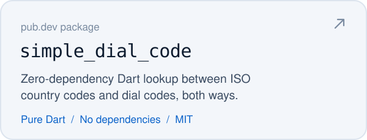
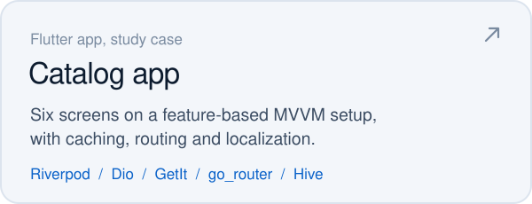
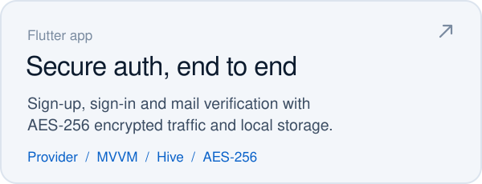
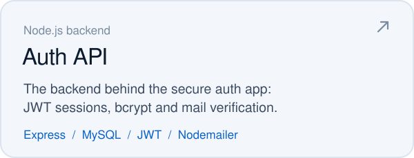
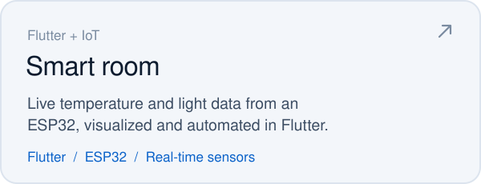

<a href="https://alikperislam.appinionsoft.com">
  <picture>
    <source media="(prefers-color-scheme: dark)" srcset="./assets/hero-dark.svg">
    <source media="(prefers-color-scheme: light)" srcset="./assets/hero-light.svg">
    
  </picture>
</a>

<br>

I build cross-platform mobile apps with Flutter at **PITON Technology** in Eskişehir. Most days that means feature-based MVVM, Riverpod or Provider for state, clean networking with Dio, and the small UI details that make an app feel finished. When a problem deserves a small, focused fix, I publish it as a package on pub.dev.

Before mobile became my full-time work, I wrote software for embedded systems and rocket avionics: telemetry, ground stations and test rigs. That background still shapes how I think about reliability and real-time data.

<br>

### Published on pub.dev

<p>
  <a href="https://pub.dev/packages/call_sound_controller"><picture><source media="(prefers-color-scheme: dark)" srcset="./assets/cards/call-sound-controller-dark.svg"></picture></a>
  <a href="https://pub.dev/packages/simple_dial_code"><picture><source media="(prefers-color-scheme: dark)" srcset="./assets/cards/simple-dial-code-dark.svg"></picture></a>
</p>

### Selected work

<p>
  <a href="https://github.com/alikperislam/ecommerce_study_case_flutter_mvvm_riverpod"><picture><source media="(prefers-color-scheme: dark)" srcset="./assets/cards/catalog-app-dark.svg"></picture></a>
  <a href="https://github.com/alikperislam/flutter-end-to-end-secure-authentication-mobile-app-mvvm-provider"><picture><source media="(prefers-color-scheme: dark)" srcset="./assets/cards/secure-auth-app-dark.svg"></picture></a>
</p>
<p>
  <a href="https://github.com/alikperislam/node-js-mobile-app-secure-authentication-backend"><picture><source media="(prefers-color-scheme: dark)" srcset="./assets/cards/auth-backend-dark.svg"></picture></a>
  <a href="https://github.com/alikperislam/flutter_esp32_smart_room_iot_mobile_app"><picture><source media="(prefers-color-scheme: dark)" srcset="./assets/cards/smart-room-dark.svg"></picture></a>
</p>

### Toolbox

```yaml
mobile:    [Flutter, Dart, Android, iOS]
state:     [Riverpod, Provider, GetX]
plumbing:  [Dio, GetIt, go_router, Hive, Easy Localization]
backend:   [Firebase, Node.js, Express, MySQL, JWT]
design:    [Figma]

# still in my repos, no longer the headline
earlier:   [C#, .NET, Python, C/C++]
```

<details>
<summary><b>Before mobile: embedded systems and rocket avionics</b></summary>
<br>

- [Teknofest 2022 ground station](https://github.com/alikperislam/Teknofest2022_RoketVeriPaketi_HakemYerIstasyonu): rocket telemetry packet and the referee ground station software
- [Engine thrust measurement](https://github.com/alikperislam/rocket_engine_thrust_measurement_system_cpp_lora_hx711_loadcell): load cell readings (HX711) sent over LoRa
- [Wireless engine ignition](https://github.com/alikperislam/rocket_engine_wireless_ignition_system_with_wifi_cpp_firebase): Wi-Fi ignition system controlled through Firebase
- [6-DOF rocket direction control](https://github.com/alikperislam/flutter_stm32_6dof_rocket_direction_control_code): STM32 and a Flutter companion app
- [IoT communication project](https://github.com/alikperislam/IoT_embedded_software_and_communication_project): embedded software and device communication in Python and C++
- [C# desktop apps](https://github.com/alikperislam?tab=repositories&language=c%23): a dozen-plus Windows apps from 2021, including a [chip tuning tool](https://github.com/alikperislam/Arac_Yazilim_Sistemleri_ChipTuning_MasaustuUygulama)

</details>

<br>

### Elsewhere

You can find more of my work on my [portfolio](https://alikperislam.appinionsoft.com), read my notes on [Medium](https://medium.com/@developer.alikper), or reach out on [LinkedIn](https://www.linkedin.com/in/alikperislam).
