<a href="https://alikperislam.appinionsoft.com"></a>

 

I'm a Mid. Flutter Developer at **PITON Technology** in Eskişehir. I build Android and iOS apps on **Clean Architecture**: a `domain` layer with models and repository contracts, a `data` layer with DTOs and the repository implementations, and a `presentation` layer split into pages, providers, states and widgets. For state management I use **Riverpod** and **Bloc**.

Outside of work I run **AppinionSoft**, where I design, build and publish my own products. Seven of my apps are live on Google Play and the App Store, and two of my packages are on pub.dev.

 

### Shipped to the stores

<a href="https://play.google.com/store/apps/details?id=com.appinionsoft.tepsio"></a>

  <a href="https://play.google.com/store/apps/details?id=enguide.mobile.app">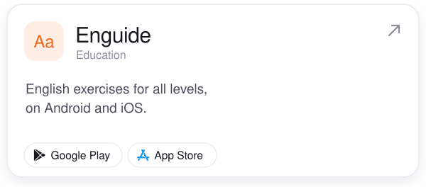</a>
  <a href="https://play.google.com/store/apps/details?id=talkntrip.mobile.app">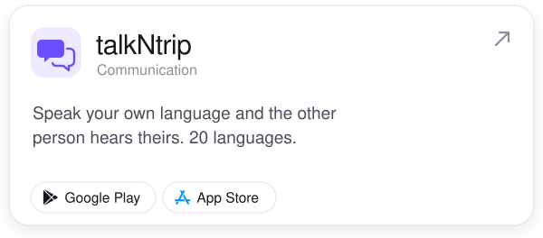</a>

  <a href="https://play.google.com/store/apps/details?id=cappadocia.vpn.mobile.app">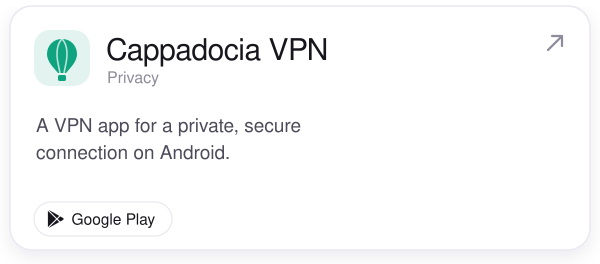</a>
  <a href="https://apps.apple.com/app/id6739890036">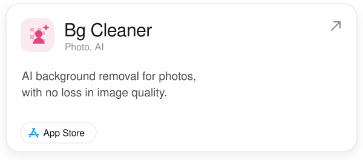</a>

Also on Google Play: <a href="https://play.google.com/store/apps/details?id=benim.deprem.uygulama">Islıkçı</a> and <a href="https://play.google.com/store/apps/details?id=hesap.makinesi.uygulamasi">Calculator</a>.

 

### How I build apps

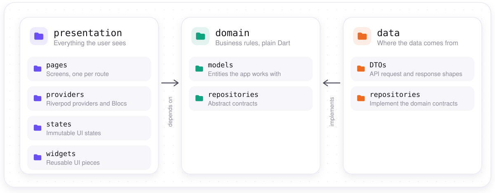

Dependencies point inward. `presentation` and `data` both depend on `domain`, never the other way around, so business rules stay independent of the UI and I can swap an API or a cache without touching a single page.

 

### Open source on pub.dev

  <a href="https://pub.dev/packages/call_sound_controller">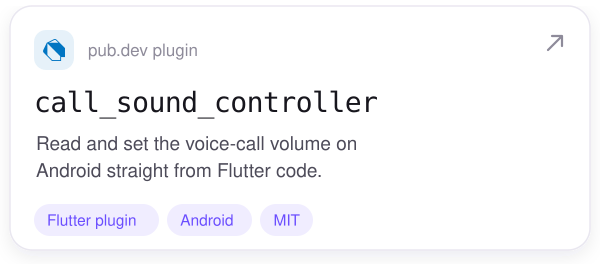</a>
  <a href="https://pub.dev/packages/simple_dial_code">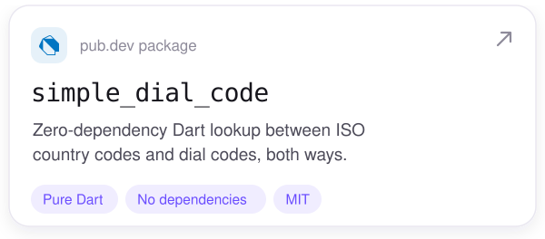</a>

### More on GitHub

  <a href="https://github.com/alikperislam/ecommerce_study_case_flutter_mvvm_riverpod">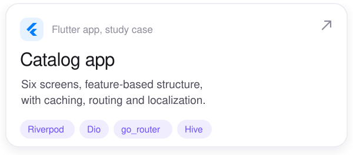</a>
  <a href="https://github.com/alikperislam/flutter-end-to-end-secure-authentication-mobile-app-mvvm-provider">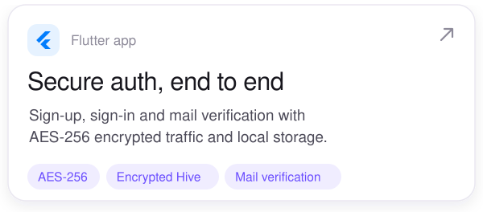</a>

  <a href="https://github.com/alikperislam/node-js-mobile-app-secure-authentication-backend">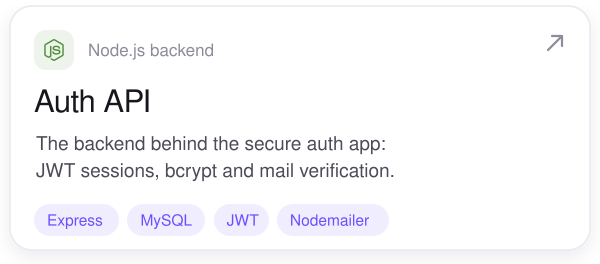</a>
  <a href="https://github.com/alikperislam/flutter_esp32_smart_room_iot_mobile_app">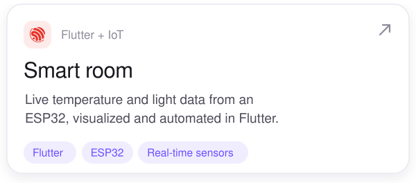</a>

### Toolbox

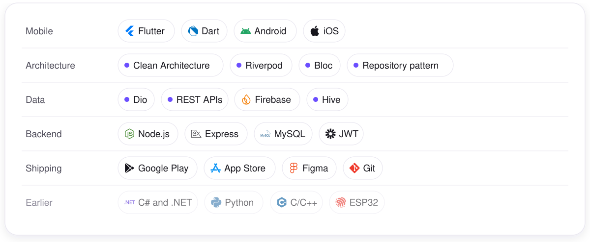

<b>Before mobile: embedded systems and rocket avionics</b>

 

Before Flutter became my full-time work, I wrote software for embedded systems and rocket avionics. That background still shapes how I think about reliability and real-time data.

- [Teknofest 2022 ground station](https://github.com/alikperislam/Teknofest2022_RoketVeriPaketi_HakemYerIstasyonu): rocket telemetry packet and the referee ground station software
- [Engine thrust measurement](https://github.com/alikperislam/rocket_engine_thrust_measurement_system_cpp_lora_hx711_loadcell): load cell readings (HX711) sent over LoRa
- [Wireless engine ignition](https://github.com/alikperislam/rocket_engine_wireless_ignition_system_with_wifi_cpp_firebase): Wi-Fi ignition system controlled through Firebase
- [6-DOF rocket direction control](https://github.com/alikperislam/flutter_stm32_6dof_rocket_direction_control_code): STM32 and a Flutter companion app
- [IoT communication project](https://github.com/alikperislam/IoT_embedded_software_and_communication_project): embedded software and device communication in Python and C++
- [C# desktop apps](https://github.com/alikperislam?tab=repositories&language=c%23): a dozen-plus Windows apps from 2021, including a [chip tuning tool](https://github.com/alikperislam/Arac_Yazilim_Sistemleri_ChipTuning_MasaustuUygulama)

 

### Get in touch

  
  
  
  
  

